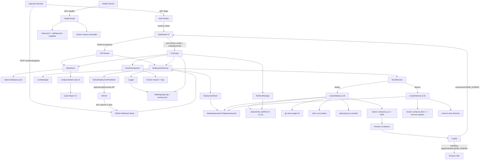

# PreviewOrch Architecture

This diagram shows the end-to-end control flow from operator input or GitHub webhook to Docker Compose preview lifecycle and dashboard feedback.

## Key Files

- `src/server.ts`: process entrypoint
- `src/app.ts`: Express wiring
- `src/routes/auth.ts`: login/logout
- `src/routes/ui.ts`: dashboard and HTML fragment refreshes
- `src/routes/api.ts`: repo, deployment, and SSH actions
- `src/routes/github-webhooks.ts`: webhook verification and routing
- `src/lib/repo-store.ts`: repository persistence and validation
- `src/lib/deployment-service.ts`: deploy/destroy orchestration
- `src/lib/deployment-store.ts`: deployment metadata persistence
- `src/lib/runtime-inspector.ts`: Docker runtime inspection for the UI
- `src/lib/github-deployment-publisher.ts`: optional GitHub Deployments updates
- `scripts/validate-repo.sh`: pre-save repo validation
- `scripts/deploy-pr.sh`: preview creation
- `scripts/destroy-pr.sh`: preview teardown
