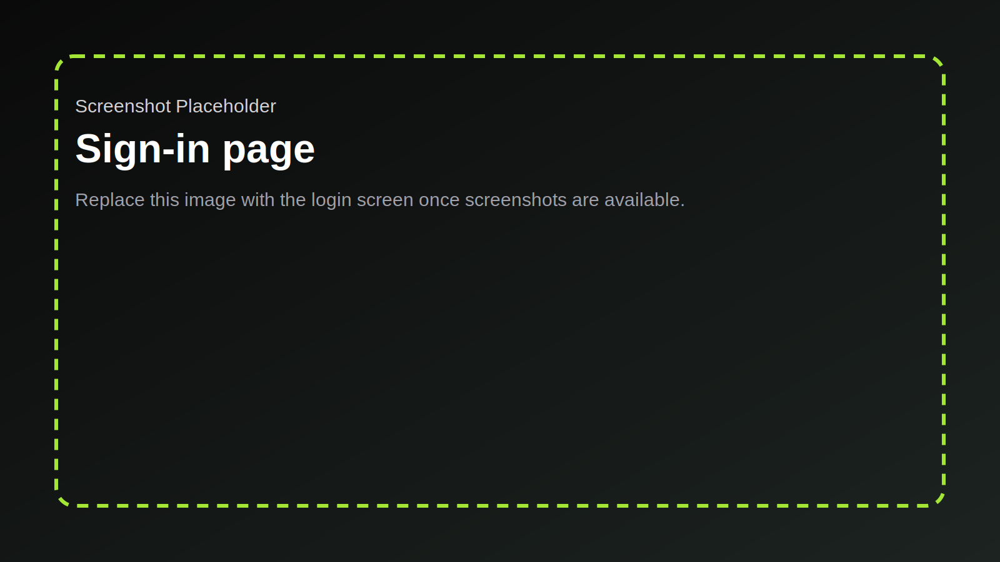
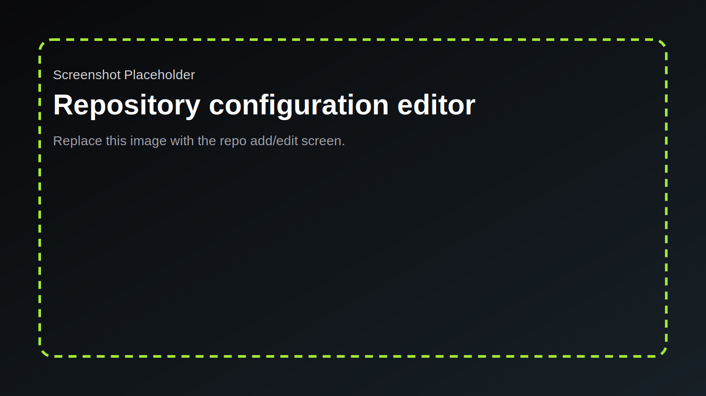
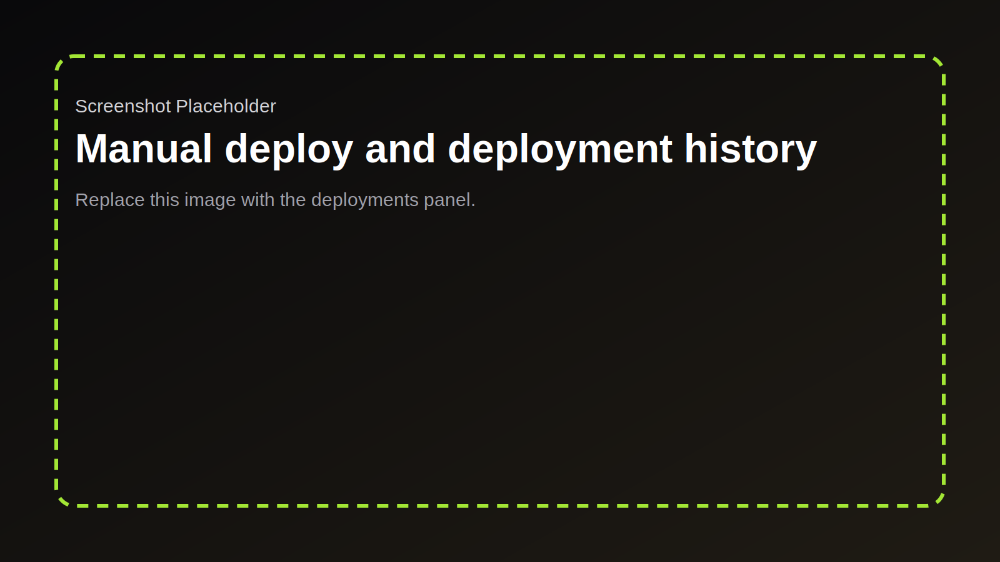
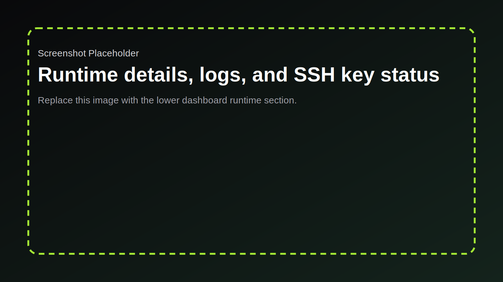

# How PreviewOrch Works

This app is a small orchestrator that sits between GitHub pull requests and Docker Compose preview environments. It combines a server-rendered admin UI, a thin browser client, disk-backed state, and shell scripts that do the actual deployment work.

## High-Level Model

- The Express app is the control plane.
- GitHub webhooks and operator actions both end up in the same deployment service.
- Repositories, deployment metadata, SSH keys, and logs are persisted on disk under `data/`.
- Shell scripts own the clone, env-file, Compose, and teardown steps.
- Traefik exposes both the admin UI and per-preview hostnames.

See the end-to-end diagram in [architecture.md](./architecture.md).

## Operator Entry Points

### 1. Sign In

The login form posts to `/login`. Credentials are checked against `ADMIN_USERNAME` and `ADMIN_PASSWORD_BCRYPT_HASH`, then the app creates a session using `express-session`.

Relevant files:

- `src/routes/auth.ts`
- `src/lib/auth.ts`
- `src/views/login.ejs`

### 2. Configure a Repository

The dashboard repository editor creates or updates entries in `data/config/repos.json`. Before a repo is saved, PreviewOrch runs `scripts/validate-repo.sh` to prove the repo can be cloned and that its Compose configuration satisfies the preview contract.

Validation covers:

- `git ls-remote` against the configured SSH URL
- Shallow clone of the default branch
- Working directory existence
- Compose file existence
- Public service existence
- Traefik label contract, unless PreviewOrch will append a proxy override for that service

Relevant files:

- `src/routes/api.ts`
- `src/lib/repo-store.ts`
- `src/lib/repo-config.ts`
- `scripts/validate-repo.sh`

### 3. Trigger a Deployment

Deployments can start in two ways:

- A GitHub `pull_request` webhook with action `opened`, `reopened`, or `synchronize`
- A manual deploy from the dashboard for either a branch or a PR number

Both paths end up in `DeploymentService`. That service calculates a stable deployment key, writes seed metadata, acquires a per-deployment lock, and calls the deploy script.

Relevant files:

- `src/routes/github-webhooks.ts`
- `src/lib/github.ts`
- `src/lib/deployment-service.ts`
- `src/lib/lock-manager.ts`

## Deployment Lifecycle

### Deploy

`scripts/deploy-pr.sh` is the execution layer for preview creation.

It does the following:

1. Resolves the deployment paths and naming fields through `dist/src/cli/script-helper.js`.
2. Selects the active SSH key from `data/ssh/`.
3. Tears down any previous Compose project for the same deployment key.
4. Clones the requested branch, PR head, or commit SHA into a temporary checkout.
5. Replaces the working directory contents under `data/deployments/...`.
6. Writes `.env.runtime` with `ORCH_PREVIEW_HOST`, `ORCH_PROJECT_NAME`, and repo-specific extra env vars.
7. Optionally writes a proxy override file when `appendProxySettings` is enabled.
8. Runs `docker compose up -d --build`.
9. Writes the final deployment metadata JSON so the dashboard and destroy path can find the active project again.

If `GITHUB_DEPLOYMENTS_TOKEN` is configured, the app also publishes pending/success/failure status updates back to GitHub. That publishing is best-effort and does not block the preview itself.

### Destroy

Destroy is triggered by:

- A `pull_request.closed` webhook
- The dashboard `Destroy` action

`scripts/destroy-pr.sh` reads the stored deployment metadata, reconstructs the Compose command, and removes the working directory. It uses `docker compose down -v --remove-orphans` for PR/branch previews, while default-branch deployments use `docker compose down --remove-orphans` to keep volumes.

## Dashboard Runtime View

The dashboard is mostly server-rendered EJS, with a small browser client in `src/client/app.ts`.

The browser code:

- Intercepts form submits for JSON API requests
- Intercepts deploy, redeploy, destroy, and SSH-key actions
- Polls `/ui/repo-config` and `/ui/deployments` every 5 seconds
- Preserves the selected repo panel and expanded deployment details

The runtime panel shows:

- Deployment metadata from disk
- The per-deployment script log tail
- Docker runtime inspection results for matching Compose containers
- Public service labels and recent container logs
- The active SSH public key used for GitHub access

Relevant files:

- `src/routes/ui.ts`
- `src/views/dashboard.ejs`
- `src/views/partials/repo-config.ejs`
- `src/views/partials/deployments-panel.ejs`
- `src/client/app.ts`
- `src/lib/runtime-inspector.ts`

## Files Written At Runtime

### `data/config/`

- `repos.json`: repository definitions managed from the UI
- `settings.json`: reserved settings file

### `data/deployments/`

- One directory per `{repoSlug}/{deploymentKey}`
- Working copy of the deployed repo
- `deployment.json` metadata used for redeploy/destroy
- `.env.runtime`
- Optional proxy override file

### `data/logs/`

- `app.log`: operator-oriented application log
- `events.jsonl`: event log stream
- Per-deployment script logs

### `data/ssh/`

- `id_ed25519` and `id_ed25519.pub` when generated from the dashboard
- Legacy `id_rsa` fallback is still supported by the scripts

## Routing Model

- `/login`, `/logout`: session auth
- `/`: authenticated dashboard
- `/ui/repo-config`, `/ui/deployments`: HTML fragments for polling refreshes
- `/api/repos`: repo CRUD
- `/api/repos/:id/manual-deploy`: branch or PR deploy
- `/api/deployments/:id/redeploy`: rerun an existing target
- `/api/deployments/:id`: destroy a deployment
- `/api/ssh-keypair`: generate or rotate the GitHub SSH key
- `/webhooks/github`: GitHub webhook intake
- `/healthz`: health endpoint

## Failure Model

- Invalid webhook signatures are rejected with `401`.
- Unsupported GitHub events are ignored with `200`.
- PRs blocked by the repo trigger policy are ignored with `200`.
- Repository validation failures are returned as `400`.
- Script failures are recorded in metadata and logs, then surfaced in the UI and API as `500`.
- Deployment work is serialized per `{repoId, deploymentKey}` so duplicate webhook storms do not run the same target concurrently inside one Node process.
